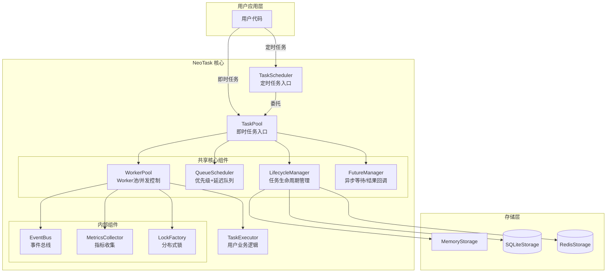
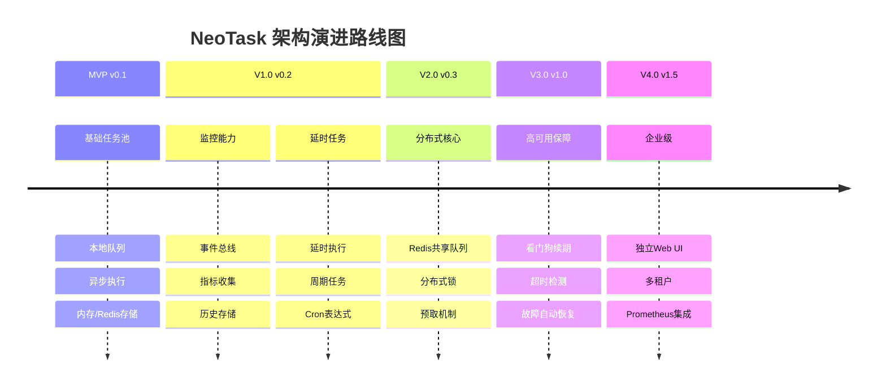

# 分布式任务调度系统（NeoTask）

轻量级 Python 异步任务队列管理器，无需额外服务，开箱即用。

> NeoTask 是一个纯 Python 实现的异步任务队列调度系统，专为耗时任务（AI 生成、视频处理、数据爬取等）设计，支持定时任务、周期任务、延迟任务。无需部署 Redis、PostgreSQL 等外部服务，安装后即可在任意 Python 项目中直接使用。

中文 | [English](./docs/README-en.md) | [文档](https://pengline.cn/2026/04/243d5a536d064df59c2ec8668362b8b5/) | [PyPI](https://pypi.org/project/neotask/) | [官网](https://task.pengline.cn)

[](LICENSE) [](https://www.python.org/) [](https://pypi.org/project/penshot/) [](https://pepy.tech/project/neotask)

---

## 特性

- **零依赖部署** - 纯 Python 实现，无需 Redis/PostgreSQL
- **即时任务** - 支持优先级调度，高优先级优先执行
- **定时任务** - 支持延时执行、固定间隔、Cron 表达式
- **异步并发** - 基于 asyncio，多 Worker 并发处理
- **自动重试** - 失败任务自动重试，可配置次数
- **持久化** - 内存/SQLite/Redis 多种存储后端
- **事件回调** - 支持任务生命周期事件监听

------

## 应用场景

| 场景                   | 说明                         | 推荐配置                | 使用入口      |
| :--------------------- | :--------------------------- | :---------------------- | :------------ |
| **AI 文生图/视频生成** | 耗时任务排队，避免阻塞主流程 | `worker_concurrency=3`  | TaskPool      |
| **批量文件处理**       | 转码、压缩、上传等批量操作   | `worker_concurrency=10` | TaskPool      |
| **网页爬虫调度**       | 分布式爬取，防止被封         | `storage_type="redis"`  | TaskPool      |
| **定时报表发送**       | 每天9点发送日报              | `cron="0 9 * * *"`      | TaskScheduler |
| **延迟通知**           | 用户操作后5分钟发送提醒      | `delay_seconds=300`     | TaskScheduler |
| **心跳检测**           | 每30秒检测服务健康状态       | `interval_seconds=30`   | TaskScheduler |
| **后台数据分析**       | 夜间执行数据聚合任务         | `cron="0 2 * * *"`      | TaskScheduler |

---

## 架构&演进



发展路线图



------

## 快速上手

详细使用方式 请参阅 [文档](https://pengline.cn/2026/04/118be805273f47408bc580c4bd1203d8/)

### 安装

```sh
# 基础安装
pip install neotask

# 带 Redis 分布式支持
pip install neotask[redis]

# 完整安装
pip install neotask[full]
```


### 即时任务（TaskPool）

```python
from neotask import TaskPool

async def process(data):
    return {"result": "done", "data": data}

# 创建任务池
pool = TaskPool(executor=process)

# 提交任务
task_id = pool.submit({"id": 123})

# 等待结果
result = pool.wait_for_result(task_id)

pool.shutdown()
```

### 定时任务（TaskScheduler）

```python
from neotask import TaskScheduler

scheduler = TaskScheduler(executor=process)

# 延时 60 秒执行
scheduler.submit_delayed({"id": 123}, delay_seconds=60)

# 每 5 分钟执行一次
scheduler.submit_interval({"id": 123}, interval_seconds=300)

# 每天 9 点执行
scheduler.submit_cron({"id": 123}, "0 9 * * *")

scheduler.shutdown()
```

### 使用上下文管理器

```python
with TaskPool(executor=process) as pool:
    task_id = pool.submit({"id": 123})
    result = pool.wait_for_result(task_id)
```

### 使用事件回调

```python
from neotask import TaskPool

async def on_task_created(event):
    print(f"任务创建: {event.task_id}")

async def on_task_completed(event):
    print(f"任务完成: {event.task_id}, 结果: {event.data}")

async def on_task_failed(event):
    print(f"任务失败: {event.task_id}, 错误: {event.data}")

pool = TaskPool(executor=my_executor)
pool.start()

# 注册事件回调
pool.on_created(on_task_created)
pool.on_completed(on_task_completed)
pool.on_failed(on_task_failed)

task_id = pool.submit({"test": "event"})
result = pool.wait_for_result(task_id)
```


## API 参考

| 方法                                         | 说明      |
| :------------------------------------------- | :-------- |
| `pool.submit(data, priority=2, delay=0)`     | 提交任务  |
| `pool.wait_for_result(task_id, timeout=300)` | 等待结果  |
| `pool.get_status(task_id)`                   | 获取状态  |
| `pool.cancel(task_id)`                       | 取消任务  |
| `scheduler.submit_delayed(data, delay)`      | 延时任务  |
| `scheduler.submit_interval(data, interval)`  | 周期任务  |
| `scheduler.submit_cron(data, cron)`          | Cron 任务 |

详细 API 请参阅 [文档](https://pengline.cn/2026/04/650ac5bb41c74e26bc4effcec88bf26c/)


## 配置示例

```python
from neotask import TaskPool, TaskPoolConfig

config = TaskPoolConfig(
    worker_concurrency=10,      # 并发 Worker 数
    max_retries=3,              # 重试次数
    storage_type="sqlite",      # 存储类型
)

pool = TaskPool(executor=process, config=config)
```

详细使用示例请参阅 [文档](https://pengline.cn/2026/04/fa51edd849b24f48b4d7fa8e27efef77/)


## 贡献指南

### 开发环境设置

```python
# 克隆仓库
git clone https://github.com/neopen/task-schedule-manager.git
cd task-schedule-manager

# 创建虚拟环境
python -m venv venv
source venv/bin/activate  # Windows: venv\Scripts\activate

# 安装开发依赖
pip install -e ".[dev]"

# 运行测试
pytest tests/

# 查看测试覆盖率
pytest --cov=neotask tests/

# 运行特定模块测试
pytest tests/test_task_pool.py -v
pytest tests/test_task_scheduler.py -v
```

### 项目结构

```
neotask/
├── api/           # TaskPool, TaskScheduler
├── core/          # 生命周期、队列、Worker
├── storage/       # 内存/SQLite/Redis
├── event/         # 事件总线
└── models/        # 数据模型
```


### 贡献流程

欢迎提交 Issue 和 Pull Request

1. Fork 项目
2. 创建特性分支 (`git checkout -b feature/amazing`)
3. 提交更改 (`git commit -m 'Add amazing feature'`)
4. 推送分支 (`git push origin feature/amazing`)
5. 提交 Pull Request

### 代码规范

- 遵循 [PEP 8](https://peps.python.org/pep-0008/) 代码风格
- 添加适当的 [类型注解](https://peps.python.org/pep-0484/)
- 编写单元测试覆盖新功能（覆盖率 ≥ 80%）
- 更新相关文档和示例代码
- 提交信息遵循 [Conventional Commits](https://www.conventionalcommits.org/)

### 测试要求

```sh
# 运行所有测试
pytest tests/

# 运行特定模块测试
pytest tests/unit/test_task.py

# 运行手动测试
python examples/01_simple.py
python examples/05_webui.py
```

## 问题反馈

- **提交 Issue**：https://github.com/neopen/task-schedule-manager/issues
- **功能建议**：使用 Enhancement 标签
- **Bug 报告**：使用 Bug 标签并提供复现步骤
- **安全漏洞**：请直接发送邮件至作者邮箱

------

## 许可证

MIT License © 2026 NeoPen

------

## 致谢

感谢所有贡献者和开源社区的支持。

------

## 联系方式

- 项目主页：https://github.com/neopen/task-schedule-manager
- 作者：NeoPen
- 邮箱：helpenx@gmail.com
- 文档：https://pengline.cn/2026/04/243d5a536d064df59c2ec8668362b8b5