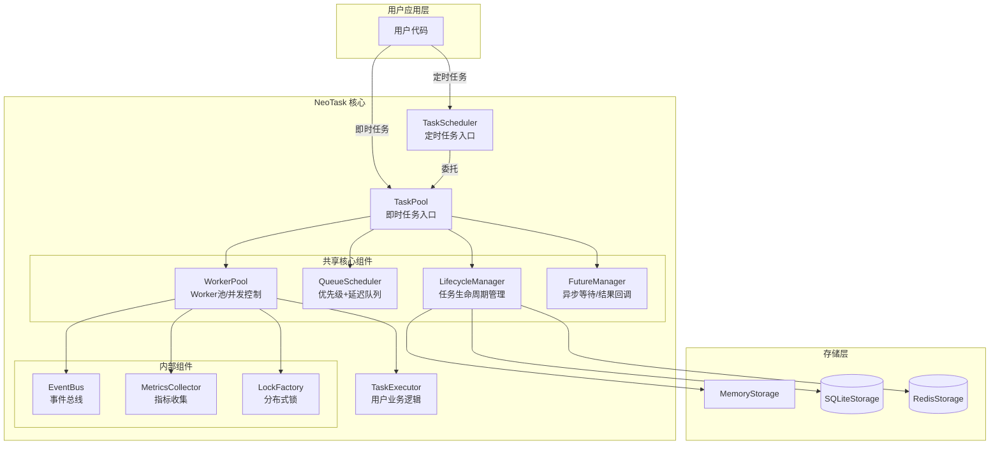
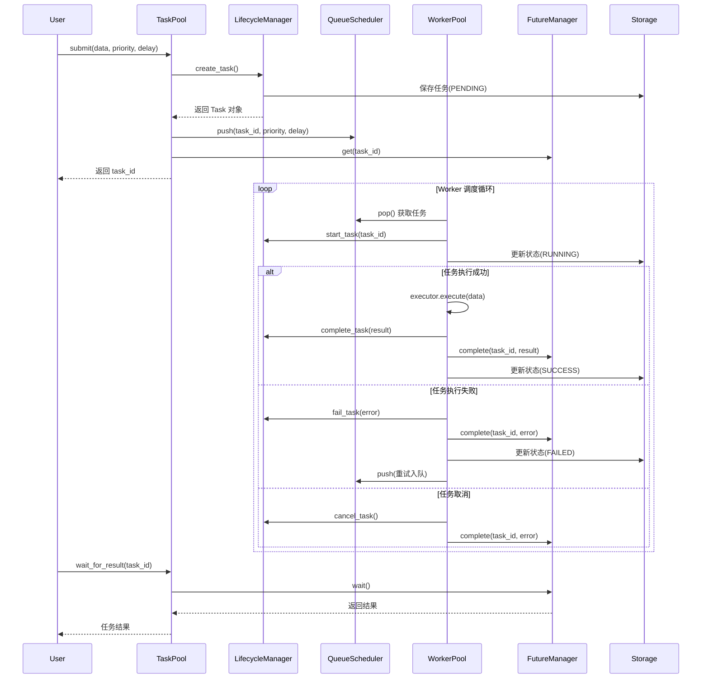
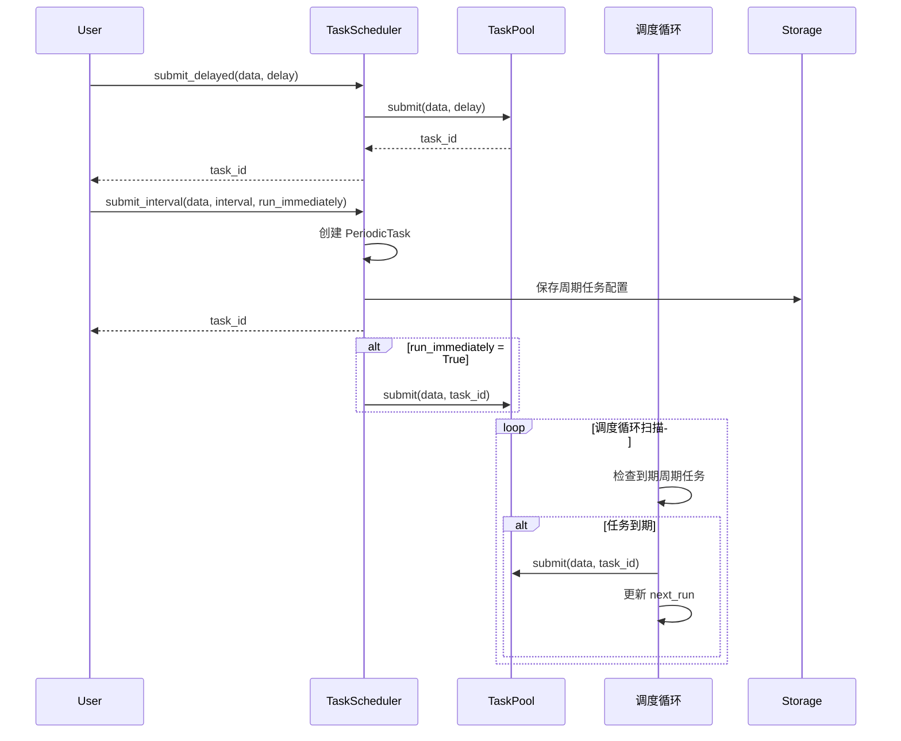
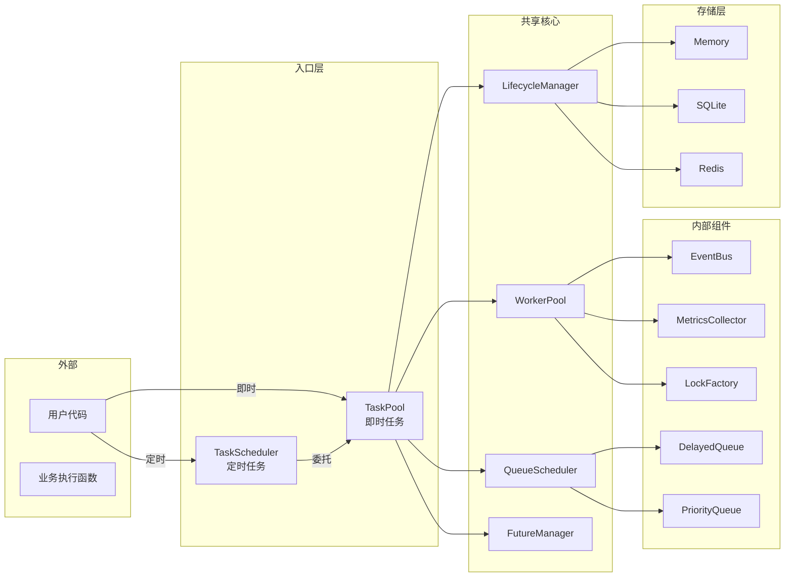
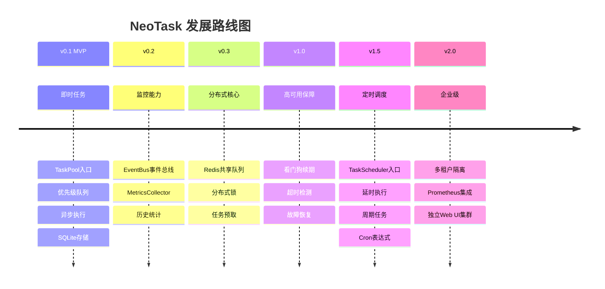

# 任务管理器（NeoTask）

轻量级 Python 异步任务队列管理器，无需额外服务，开箱即用。

NeoTask 是一个纯 Python 实现的异步任务调度系统，专为耗时任务（AI 生成、视频处理、数据爬取等）设计。无需部署 Redis、PostgreSQL 等外部服务，安装后即可在任意 Python 项目中直接使用。

[中文](../README.md) | [English](./docs/README-en.md) | [文档](https://pengline.cn/2026/04/243d5a536d064df59c2ec8668362b8b5/) | [PyPI](https://pypi.org/project/neotask/) | [官网](https://task.pengline.cn)

---

## 核心功能

| 功能 | 说明 |
|------|------|
| **零依赖部署** | 纯 Python 实现，内置 SQLite 支持，无需启动独立服务 |
| **即时任务** | 提交后立即进入队列，支持优先级调度 |
| **延时任务** | 指定延迟时间或具体时间点执行 |
| **周期任务** | 支持固定间隔和 Cron 表达式周期执行 |
| **异步并发调度** | 基于 asyncio，支持多 Worker 并发执行 |
| **优先级队列** | 高优先级任务优先执行 |
| **自动重试** | 失败任务自动重试，支持配置重试次数 |
| **持久化存储** | 内存/SQLite/Redis 多种存储后端 |
| **任务等待** | 支持同步/异步等待任务完成并获取结果 |
| **事件回调** | 支持任务创建、开始、完成、失败等事件回调 |

---

## 架构设计



### 即时任务数据流图



### 定时任务数据流图




### 组件关系图




## 快速上手

### 安装

```sh
# 基础安装
pip install neotask

# 带 Redis 分布式支持
pip install neotask[redis]

# 完整安装
pip install neotask[full]
```


### 即时任务（TaskPool）

```python
from neotask import TaskPool

# 1. 定义任务处理函数（异步）
async def my_executor(data: dict) -> dict:
    """业务逻辑处理函数"""
    print(f"处理任务: {data}")
    # 模拟耗时操作
    import asyncio
    await asyncio.sleep(0.1)
    return {"result": "success", "input": data}

# 2. 创建任务池
pool = TaskPool(
    executor=my_executor,
    config=TaskPoolConfig(
        worker_concurrency=5,      # 并发 Worker 数
        max_retries=3,             # 最大重试次数
        storage_type="sqlite",     # 存储类型: memory/sqlite/redis
    )
)

# 3. 提交即时任务
task_id = pool.submit({"action": "process", "id": 123})

# 4. 等待结果（同步）
result = pool.wait_for_result(task_id, timeout=30)
print(f"任务结果: {result}")

# 5. 异步方式
import asyncio
async def main():
    task_id = await pool.submit_async({"action": "async_process"})
    result = await pool.wait_for_result_async(task_id)
    return result

# 6. 优雅关闭
pool.shutdown()
```

### 定时任务（TaskScheduler）

```python
from neotask import TaskScheduler, SchedulerConfig
from datetime import datetime, timedelta

async def my_executor(data: dict) -> dict:
    """业务逻辑处理函数"""
    print(f"定时任务执行: {data}")
    return {"status": "done", "timestamp": datetime.now().isoformat()}

# 创建调度器
scheduler = TaskScheduler(
    executor=my_executor,
    config=SchedulerConfig(
        storage_type="sqlite",
        worker_concurrency=5,
        max_retries=3
    )
)

# 延时执行（60秒后执行）
task_id = scheduler.submit_delayed(
    {"action": "delayed_task"},
    delay_seconds=60
)

# 指定时间点执行
tomorrow = datetime.now() + timedelta(days=1)
task_id = scheduler.submit_at(
    {"action": "scheduled_task"},
    execute_at=tomorrow
)

# 周期执行（每5分钟执行一次）
task_id = scheduler.submit_interval(
    {"action": "periodic_task"},
    interval_seconds=300,
    run_immediately=True   # 是否立即执行第一次
)

# Cron 表达式（每天9点执行）
task_id = scheduler.submit_cron(
    {"action": "daily_report"},
    cron_expr="0 9 * * *"
)

# 管理周期任务
scheduler.pause_periodic(task_id)   # 暂停
scheduler.resume_periodic(task_id)  # 恢复
scheduler.cancel_periodic(task_id)  # 取消

# 等待任务完成
result = scheduler.wait_for_result(task_id, timeout=300)

# 关闭调度器
scheduler.shutdown()
```


### 使用事件回调

```python
async def my_executor(data: Dict[str, Any]) -> Dict[str, Any]:
    """成功的执行器"""
    return {"status": "success", "input": data, "timestamp": time.time()}

pool = TaskPool(executor=my_executor)
pool.start()

# 注册事件回调
async def on_task_completed(event):
    print(f"任务完成: {event.task_id}, 结果: {event.data}")

pool.on_completed(on_task_completed)

# 提交任务
task_id = pool.submit({"data": "value"})
```


### 使用上下文管理器

```python
from neotask import TaskPool

# 自动启动和关闭
with TaskPool(executor=my_executor) as pool:
    task_id = pool.submit({"data": "value"})
    result = pool.wait_for_result(task_id)
    print(result)
# 退出上下文时自动关闭
```

### 使用事件回调

```python
from neotask import TaskPool

async def on_task_created(event):
    print(f"任务创建: {event.task_id}")

async def on_task_completed(event):
    print(f"任务完成: {event.task_id}, 结果: {event.data}")

async def on_task_failed(event):
    print(f"任务失败: {event.task_id}, 错误: {event.data}")

pool = TaskPool(executor=my_executor)
pool.start()

# 注册事件回调
pool.on_created(on_task_created)
pool.on_completed(on_task_completed)
pool.on_failed(on_task_failed)

task_id = pool.submit({"test": "event"})
result = pool.wait_for_result(task_id)
```


## API 参考

### TaskPool（即时任务）

| 方法                                                        | 说明                       |
| :---------------------------------------------------------- | :------------------------- |
| `submit(data, task_id=None, priority=2, delay=0, ttl=3600)` | 提交即时任务，返回 task_id |
| `submit_async(...)`                                         | 异步提交任务               |
| `submit_batch(tasks, priority=2)`                           | 批量提交任务               |
| `wait_for_result(task_id, timeout=300)`                     | 同步等待任务完成           |
| `wait_for_result_async(task_id, timeout)`                   | 异步等待任务完成           |
| `wait_all(task_ids, timeout)`                               | 等待所有任务完成           |
| `get_status(task_id)`                                       | 获取任务状态               |
| `get_result(task_id)`                                       | 获取任务结果               |
| `get_task(task_id)`                                         | 获取完整任务信息           |
| `task_exists(task_id)`                                      | 检查任务是否存在           |
| `cancel(task_id)`                                           | 取消任务                   |
| `delete(task_id)`                                           | 删除任务                   |
| `retry(task_id, delay=0)`                                   | 重试失败的任务             |
| `get_stats()`                                               | 获取实时统计               |
| `pause()`                                                   | 暂停处理新任务             |
| `resume()`                                                  | 恢复处理新任务             |
| `clear_queue()`                                             | 清空队列                   |
| `shutdown(graceful=True)`                                   | 关闭任务池                 |
| `on_created(handler)`                                       | 注册任务创建事件           |
| `on_started(handler)`                                       | 注册任务开始事件           |
| `on_completed(handler)`                                     | 注册任务完成事件           |
| `on_failed(handler)`                                        | 注册任务失败事件           |
| `on_cancelled(handler)`                                     | 注册任务取消事件           |

### TaskScheduler（定时任务）

| 方法                                                         | 说明                |
| :----------------------------------------------------------- | :------------------ |
| `submit_delayed(data, delay_seconds, task_id=None, priority=2)` | 延时执行任务        |
| `submit_at(data, execute_at, task_id=None, priority=2)`      | 指定时间点执行      |
| `submit_interval(data, interval_seconds, task_id=None, priority=2, run_immediately=True)` | 固定间隔周期执行    |
| `submit_cron(data, cron_expr, task_id=None, priority=2)`     | Cron 表达式周期执行 |
| `cancel_periodic(task_id)`                                   | 取消周期任务        |
| `pause_periodic(task_id)`                                    | 暂停周期任务        |
| `resume_periodic(task_id)`                                   | 恢复周期任务        |
| `get_periodic_tasks()`                                       | 获取所有周期任务    |
| `wait_for_result(task_id, timeout)`                          | 等待任务完成        |
| `get_status(task_id)`                                        | 获取任务状态        |
| `get_result(task_id)`                                        | 获取任务结果        |
| `cancel(task_id)`                                            | 取消任务            |
| `get_stats()`                                                | 获取实时统计        |
| `shutdown(graceful=True)`                                    | 关闭调度器          |

### TaskStatus 状态枚举

| 状态      | 值          | 说明               |
| :-------- | :---------- | :----------------- |
| PENDING   | "pending"   | 等待执行           |
| RUNNING   | "running"   | 执行中             |
| SUCCESS   | "success"   | 执行成功           |
| FAILED    | "failed"    | 执行失败           |
| CANCELLED | "cancelled" | 已取消             |
| SCHEDULED | "scheduled" | 已调度（定时任务） |

### TaskPriority 优先级

| 优先级   | 值   | 说明               |
| :------- | :--- | :----------------- |
| CRITICAL | 0    | 最高优先级         |
| HIGH     | 1    | 高优先级           |
| NORMAL   | 2    | 普通优先级（默认） |
| LOW      | 3    | 低优先级           |

### 配置选项

#### TaskPoolConfig

```python
from neotask import TaskPoolConfig

config = TaskPoolConfig(
    # 存储配置
    storage_type="memory",      # memory / sqlite / redis
    sqlite_path="neotask.db",   # SQLite 数据库路径
    redis_url=None,             # Redis 连接 URL
    
    # 执行器配置
    executor_type="async",      # 执行器类型
    max_workers=10,             # 最大工作线程数
    
    # Worker 配置
    worker_concurrency=10,      # 并发 Worker 数
    prefetch_size=20,           # 预取任务数量
    task_timeout=None,          # 任务超时时间（秒）
    
    # 队列配置
    queue_max_size=10000,       # 队列最大长度
    priority_levels=4,          # 优先级级别数
    
    # 锁配置
    lock_type="memory",         # memory / redis
    lock_timeout=30,            # 锁超时时间
    
    # 重试配置
    max_retries=3,              # 最大重试次数
    retry_delay=1.0,            # 重试延迟（秒）
    
    # 监控配置
    enable_metrics=True,        # 启用指标收集
    enable_health_check=True,   # 启用健康检查
    enable_reporter=False,      # 启用上报器
)
```

#### SchedulerConfig

```python
from neotask import SchedulerConfig

config = SchedulerConfig(
    storage_type="memory",      # memory / sqlite / redis
    sqlite_path="neotask.db",   # SQLite 数据库路径
    redis_url=None,             # Redis 连接 URL
    worker_concurrency=10,      # 并发 Worker 数
    max_retries=3,              # 最大重试次数
    retry_delay=1.0,            # 重试延迟（秒）
    enable_persistence=False,   # 启用周期任务持久化
    scan_interval=0.05,         # 调度循环扫描间隔（秒）
)
```


## 版本与展望

### 当前版本：v0.1 (MVP)

- ✅ 基础任务队列（优先级、并发控制）
- ✅ 内存/SQLite 存储
- ✅ 异步执行引擎
- ✅ 同步/异步等待结果
- ✅ 基础 Web UI
- ✅ 回调函数支持
- ✅ 任务取消功能

### 发展路线图



### 版本对比

| 特性                       | v0.1 | v0.2 | v0.3 | v1.0 | v1.5 | v2.0 |
| :------------------------- | :--- | :--- | :--- | :--- | :--- | :--- |
| **TaskPool 即时任务**      | ✅    | ✅    | ✅    | ✅    | ✅    | ✅    |
| 优先级队列                 | ✅    | ✅    | ✅    | ✅    | ✅    | ✅    |
| 内存/SQLite 存储           | ✅    | ✅    | ✅    | ✅    | ✅    | ✅    |
| Web UI                     | ✅    | ✅    | ✅    | ✅    | ✅    | ✅    |
| 事件总线                   | -    | ✅    | ✅    | ✅    | ✅    | ✅    |
| 指标收集                   | -    | ✅    | ✅    | ✅    | ✅    | ✅    |
| Redis 存储                 | -    | -    | ✅    | ✅    | ✅    | ✅    |
| 分布式锁                   | -    | -    | ✅    | ✅    | ✅    | ✅    |
| 看门狗机制                 | -    | -    | -    | ✅    | ✅    | ✅    |
| 故障恢复                   | -    | -    | -    | ✅    | ✅    | ✅    |
| **TaskScheduler 定时任务** | -    | -    | -    | -    | ✅    | ✅    |
| 延时执行                   | -    | -    | -    | -    | ✅    | ✅    |
| 周期任务                   | -    | -    | -    | -    | ✅    | ✅    |
| Cron 表达式                | -    | -    | -    | -    | ✅    | ✅    |
| 多租户                     | -    | -    | -    | -    | -    | ✅    |
| Prometheus                 | -    | -    | -    | -    | -    | ✅    |

------

## 典型应用场景

| 场景                   | 说明                         | 推荐配置                | 使用入口      |
| :--------------------- | :--------------------------- | :---------------------- | :------------ |
| **AI 文生图/视频生成** | 耗时任务排队，避免阻塞主流程 | `worker_concurrency=3`  | TaskPool      |
| **批量文件处理**       | 转码、压缩、上传等批量操作   | `worker_concurrency=10` | TaskPool      |
| **网页爬虫调度**       | 分布式爬取，防止被封         | `storage_type="redis"`  | TaskPool      |
| **定时报表发送**       | 每天9点发送日报              | `cron="0 9 * * *"`      | TaskScheduler |
| **延迟通知**           | 用户操作后5分钟发送提醒      | `delay_seconds=300`     | TaskScheduler |
| **心跳检测**           | 每30秒检测服务健康状态       | `interval_seconds=30`   | TaskScheduler |
| **后台数据分析**       | 夜间执行数据聚合任务         | `cron="0 2 * * *"`      | TaskScheduler |

------

## 性能参考

| 配置                       | 吞吐量       | 平均延迟 | 说明       |
| :------------------------- | :----------- | :------- | :--------- |
| 单 Worker，任务耗时 100ms  | ~10 tasks/s  | ~100ms   | 基础配置   |
| 10 Workers，任务耗时 100ms | ~100 tasks/s | ~110ms   | 推荐配置   |
| 50 Workers，任务耗时 100ms | ~500 tasks/s | ~120ms   | 高性能配置 |

*注：实际性能受 CPU 核心数、任务复杂度、存储 I/O 影响*

------

## 贡献指南

### 开发环境设置

```python
# 克隆仓库
git clone https://github.com/neopen/neotask.git
cd neotask

# 创建虚拟环境
python -m venv venv
source venv/bin/activate  # Windows: venv\Scripts\activate

# 安装开发依赖
pip install -e ".[dev]"

# 运行测试
pytest tests/

# 查看测试覆盖率
pytest --cov=neotask tests/

# 运行特定模块测试
pytest tests/test_task_pool.py -v
pytest tests/test_task_scheduler.py -v
```

### 项目结构

```
neotask/
├── __init__.py
├── api/
│   ├── __init__.py
│   ├── task_pool.py       # TaskPool 即时任务入口
│   └── task_scheduler.py  # TaskScheduler 定时任务入口
├── core/
│   ├── __init__.py
│   ├── dispatcher.py      # 任务分发器
│   ├── future.py          # Future 管理器
│   └── lifecycle.py       # 生命周期管理器
├── queue/
│   ├── __init__.py
│   ├── scheduler.py       # 队列调度器
│   ├── priority_queue.py  # 优先级队列
│   └── delayed_queue.py   # 延迟队列
├── worker/
│   ├── __init__.py
│   ├── pool.py            # Worker 池
│   └── supervisor.py      # Worker 监督者
├── storage/
│   ├── __init__.py
│   ├── base.py            # 存储抽象基类
│   ├── memory.py          # 内存存储
│   ├── sqlite.py          # SQLite 存储
│   └── redis.py           # Redis 存储
├── executor/
│   ├── __init__.py
│   ├── base.py            # 执行器基类
│   └── factory.py         # 执行器工厂
├── event/
│   └── bus.py             # 事件总线
├── lock/
│   └── factory.py         # 分布式锁工厂
├── models/
│   ├── __init__.py
│   ├── task.py            # 任务数据模型
│   └── config.py          # 配置模型
└── common/
    ├── __init__.py
    └── exceptions.py      # 异常定义
```


### 贡献流程

1. Fork 项目仓库
2. 创建特性分支：`git checkout -b feature/amazing_feature`
3. 提交更改：`git commit -m 'Add amazing feature'`
4. 推送分支：`git push origin feature/amazing_feature`
5. 提交 Pull Request

### 代码规范

- 遵循 [PEP 8](https://peps.python.org/pep-0008/) 代码风格
- 添加适当的 [类型注解](https://peps.python.org/pep-0484/)
- 编写单元测试覆盖新功能（覆盖率 ≥ 80%）
- 更新相关文档和示例代码
- 提交信息遵循 [Conventional Commits](https://www.conventionalcommits.org/)

### 测试要求

```sh
# 运行所有测试
pytest tests/

# 运行特定模块测试
pytest tests/unit/test_task.py

# 运行手动测试
python examples/01_simple.py
python examples/05_webui.py
```

## 问题反馈

- **提交 Issue**：https://github.com/neopen/neotask/issues
- **功能建议**：使用 Enhancement 标签
- **Bug 报告**：使用 Bug 标签并提供复现步骤
- **安全漏洞**：请直接发送邮件至作者邮箱

------

## 许可证

MIT License - 详见 [LICENSE](https://license/) 文件

Copyright (c) 2024 HiPeng

------

## 致谢

感谢所有贡献者和开源社区的支持。

------

## 联系方式

- 项目主页：https://github.com/neopen/neotask
- 作者：NeoPen
- 邮箱：helpenx@gmail.com
- 文档：https://pengline.cn/2026/03/0ec8d887591a40c98be76645d33a2f23