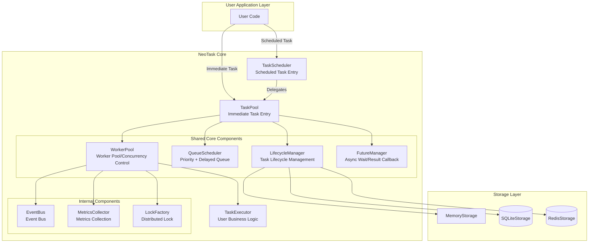
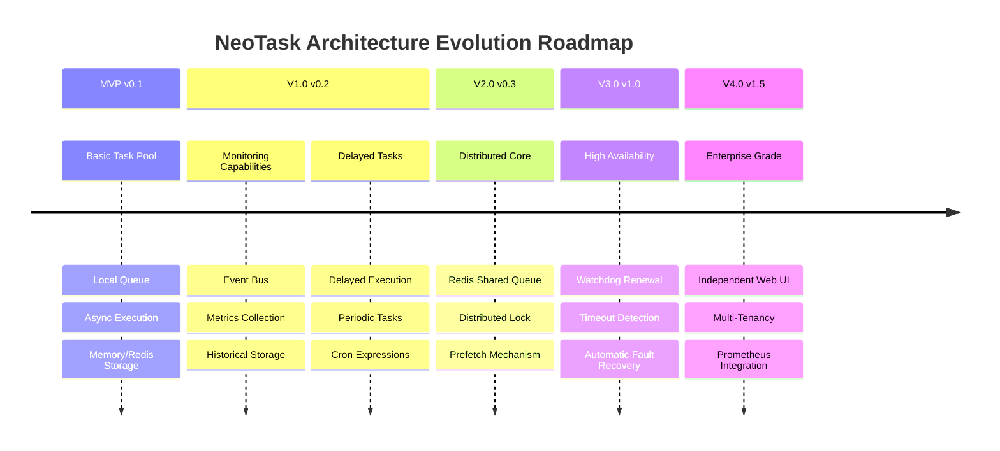

# Distributed Task Scheduling System (NeoTask)

Lightweight Python asynchronous task queue manager, no extra services required, ready to use out of the box.

> NeoTask is a pure Python-based asynchronous task queue scheduling system specifically designed for time-consuming tasks (such as AI generation, video processing, data scraping, etc.). It supports scheduled tasks, periodic tasks, and delayed tasks. There is no need to deploy external services like Redis or PostgreSQL. After installation, it can be directly used in any Python project.

[中文](../README.md) | English | [Documentation](https://pengline.cn/2026/04/243d5a536d064df59c2ec8668362b8b5) | [PyPI](https://pypi.org/project/neotask/) | [website](https://neopen.github.io/task-schedule-manager)

[](LICENSE) [](https://www.python.org/) [](https://pypi.org/project/penshot/) [](https://pepy.tech/project/neotask)

---

## Features

- **Zero-Dependency Deployment** - Pure Python implementation, no Redis/PostgreSQL required
- **Immediate Tasks** - Supports priority scheduling, high-priority tasks execute first
- **Scheduled Tasks** - Supports delayed execution, fixed intervals, and Cron expressions
- **Asynchronous Concurrency** - Based on asyncio, multi-worker concurrent processing
- **Automatic Retry** - Failed tasks automatically retry with configurable attempts
- **Persistence** - Multiple storage backends: Memory/SQLite/Redis
- **Event Callbacks** - Supports task lifecycle event listeners

------

## Use Cases

| Scenario | Description | Recommended Configuration | Entry Point |
| :--------------------- | :--------------------------- | :---------------------- | :------------ |
| **AI Text-to-Image/Video Generation** | Queue time-consuming tasks to avoid blocking main flow | `worker_concurrency=3` | TaskPool |
| **Batch File Processing** | Batch operations like transcoding, compression, uploading | `worker_concurrency=10` | TaskPool |
| **Web Scraping Scheduling** | Distributed scraping to prevent being blocked | `storage_type="redis"` | TaskPool |
| **Scheduled Report Sending** | Send daily reports at 9 AM | `cron="0 9 * * *"` | TaskScheduler |
| **Delayed Notifications** | Send reminders 5 minutes after user action | `delay_seconds=300` | TaskScheduler |
| **Heartbeat Detection** | Check service health status every 30 seconds | `interval_seconds=30` | TaskScheduler |
| **Background Data Analysis** | Execute data aggregation tasks at night | `cron="0 2 * * *"` | TaskScheduler |

---

## Architecture & Evolution



Development Roadmap



------

## Quick Start

### Installation

```sh
# Basic installation
pip install neotask

# With Redis distributed support
pip install neotask[redis]

# Full installation
pip install neotask[full]
```


### Immediate Tasks (TaskPool)

```python
from neotask import TaskPool

async def process(data):
    return {"result": "done", "data": data}

# Create task pool
pool = TaskPool(executor=process)

# Submit task
task_id = pool.submit({"id": 123})

# Wait for result
result = pool.wait_for_result(task_id)

pool.shutdown()
```

### Scheduled Tasks (TaskScheduler)

```python
from neotask import TaskScheduler

scheduler = TaskScheduler(executor=process)

# Execute after 60 seconds delay
scheduler.submit_delayed({"id": 123}, delay_seconds=60)

# Execute every 5 minutes
scheduler.submit_interval({"id": 123}, interval_seconds=300)

# Execute daily at 9 AM
scheduler.submit_cron({"id": 123}, "0 9 * * *")

scheduler.shutdown()
```

### Using Context Manager

```python
with TaskPool(executor=process) as pool:
    task_id = pool.submit({"id": 123})
    result = pool.wait_for_result(task_id)
```

### Using Event Callbacks

```python
from neotask import TaskPool

async def on_task_created(event):
    print(f"Task created: {event.task_id}")

async def on_task_completed(event):
    print(f"Task completed: {event.task_id}, Result: {event.data}")

async def on_task_failed(event):
    print(f"Task failed: {event.task_id}, Error: {event.data}")

pool = TaskPool(executor=my_executor)
pool.start()

# Register event callbacks
pool.on_created(on_task_created)
pool.on_completed(on_task_completed)
pool.on_failed(on_task_failed)

task_id = pool.submit({"test": "event"})
result = pool.wait_for_result(task_id)
```


## API Reference

| Method | Description |
| :------------------------------------------- | :-------- |
| `pool.submit(data, priority=2, delay=0)` | Submit task |
| `pool.wait_for_result(task_id, timeout=300)` | Wait for result |
| `pool.get_status(task_id)` | Get status |
| `pool.cancel(task_id)` | Cancel task |
| `scheduler.submit_delayed(data, delay)` | Delayed task |
| `scheduler.submit_interval(data, interval)` | Periodic task |
| `scheduler.submit_cron(data, cron)` | Cron task |

Detailed API documentation can be found [here](https://pengline.cn/2026/04/650ac5bb41c74e26bc4effcec88bf26c/)


## Configuration Example

```python
from neotask import TaskPool, TaskPoolConfig

config = TaskPoolConfig(
    worker_concurrency=10,      # Number of concurrent workers
    max_retries=3,              # Number of retries
    storage_type="sqlite",      # Storage type
)

pool = TaskPool(executor=process, config=config)
```

Detailed usage examples can be found [here](https://pengline.cn/2026/04/fa51edd849b24f48b4d7fa8e27efef77/)


## Contribution Guide

### Setting Up Development Environment

```sh
# Clone repository
git clone https://github.com/neopen/task-schedule-manager.git
cd task-schedule-manager

# Create virtual environment
python -m venv venv
source venv/bin/activate  # Windows: venv\Scripts\activate

# Install development dependencies
pip install -e ".[dev]"

# Run tests
pytest tests/

# View test coverage
pytest --cov=neotask tests/

# Run specific module tests
pytest tests/test_task_pool.py -v
pytest tests/test_task_scheduler.py -v
```

### Project Structure

```
neotask/
├── api/           # TaskPool, TaskScheduler
├── core/          # Lifecycle, Queue, Worker
├── storage/       # Memory/SQLite/Redis
├── event/         # Event Bus
└── models/        # Data Models
```


### Contribution Workflow

Welcome to submit Issues and Pull Requests

1. Fork the project
2. Create a feature branch (`git checkout -b feature/amazing`)
3. Commit changes (`git commit -m 'Add amazing feature'`)
4. Push branch (`git push origin feature/amazing`)
5. Submit Pull Request

### Code Style

- Follow [PEP 8](https://peps.python.org/pep-0008/) code style
- Add appropriate [type annotations](https://peps.python.org/pep-0484/)
- Write unit tests for new features (coverage ≥ 80%)
- Update relevant documentation and example code
- Commit messages follow [Conventional Commits](https://www.conventionalcommits.org/)

### Testing Requirements

```
# Run all tests
pytest tests/

# Run specific module tests
pytest tests/unit/test_task.py

# Run manual tests
python examples/01_simple.py
python examples/05_webui.py
```

## Issue Reporting

- **Submit Issue**: https://github.com/neopen/task-schedule-manager/issues
- **Feature Suggestions**: Use Enhancement label
- **Bug Reports**: Use Bug label and provide reproduction steps
- **Security Vulnerabilities**: Please send email directly to the author's email

------

## License

MIT License © 2026 NeoPen

------

## Acknowledgments

Thanks to all contributors and the open source community for their support.
